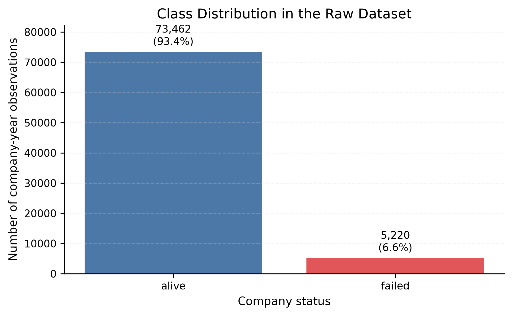
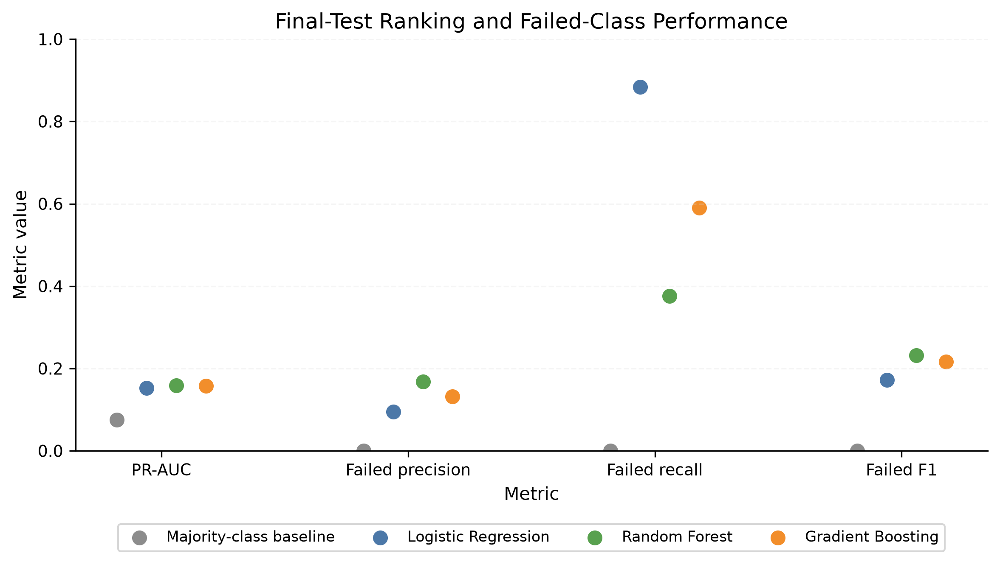
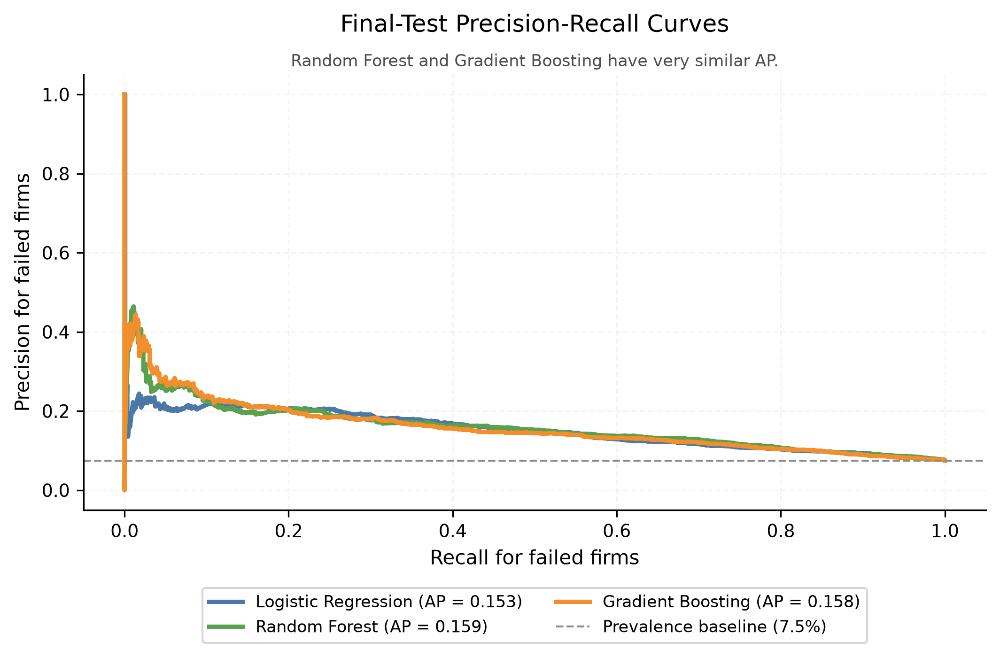

# Corporate Bankruptcy Prediction with Machine Learning

This repository contains the notebook-based implementation of a Machine
Learning for Finance project on corporate bankruptcy prediction. The analysis
is organized as six sequential Jupyter notebooks so that the methodology, model
selection, and results can be inspected and reproduced step by step.

## Project Information

| Item | Information |
|---|---|
| Author | Berke Pehlivan |
| Course | Machine Learning for Finance |
| Institution | University of Bonn |
| Python | 3.11 |
| Interface | Jupyter notebooks |

## Research Question

The project evaluates whether accounting variables can identify failed
company-year observations for previously unseen companies. It also studies the
trade-off between detecting failed firms and creating false alarms.

## Dataset

The analysis uses the American corporate bankruptcy dataset published by
Lombardo et al. (2022), "Machine Learning for Bankruptcy Prediction in the
American Stock Market: Dataset and Benchmarks" (*Future Internet*, 14(8), 244,
DOI: 10.3390/fi14080244).

One row represents one company in one year. Companies can appear in several
years, so the train/test splits are made by company rather than by individual
row. The raw dataset is included in `data/raw/american_bankruptcy.csv`.

| Dataset property | Value |
|---|---:|
| Observations | 78,682 |
| Companies | 8,971 |
| Years | 1999-2018 |
| Financial predictors | 18 (`X1`-`X18`) |
| Alive observations | 73,462 (93.4%) |
| Failed observations | 5,220 (6.6%) |
| Failure share | 6.6% |
| Missing values | 0 |
| Duplicate rows | 0 |

The source target labels are `alive` and `failed`. In the modelling files,
`failed` is encoded as `1` and `alive` as `0`; the failed class is the positive
class throughout the analysis. The MIT Licence applies to the project code, but
the original dataset remains subject to its source and terms.

## Methodology

The workflow keeps model selection and final evaluation separate:

- an outer company-level train/test split uses test share `0.20`;
- an internal company-level training/validation split uses validation share
  `0.20`;
- all split operations use random state `42`;
- company identifiers are checked so companies do not overlap across splits;
- validation PR-AUC is the primary model-selection metric because the failed
  class is rare;
- the final test set is not used for model selection;
- validation rows are not added back before final evaluation;
- threshold analysis is validation-only;
- PCA is an additional Logistic Regression extension;
- Notebook 06 only generates paper-ready assets from verified outputs.

## Models

The seven main model specifications are:

1. Majority-Class Baseline
2. Logistic Regression
3. L1 Regularized Logistic Regression
4. L2 Regularized Logistic Regression
5. Decision Tree
6. Random Forest
7. Gradient Boosting

PCA Logistic Regression is reported as an extension, not as one of the seven
main models.

## Main Results

The table reports final-test metrics for the failed class using the saved
canonical output in `outputs/tables/final_test_metrics.csv`.

| Model | PR-AUC | ROC-AUC | F1 | Recall | Precision |
|---|---:|---:|---:|---:|---:|
| Majority-class baseline | 0.075 | 0.500 | 0.000 | 0.000 | 0.000 |
| Logistic Regression | 0.153 | 0.690 | 0.172 | 0.884 | 0.095 |
| L1 Regularized Logistic Regression | 0.154 | 0.692 | 0.172 | 0.889 | 0.095 |
| L2 Regularized Logistic Regression | 0.153 | 0.692 | 0.172 | 0.888 | 0.095 |
| Decision Tree | 0.122 | 0.633 | 0.173 | 0.558 | 0.102 |
| Random Forest | 0.159 | 0.699 | 0.232 | 0.376 | 0.168 |
| Gradient Boosting | 0.158 | 0.688 | 0.216 | 0.590 | 0.132 |

Gradient Boosting was selected using validation PR-AUC before the final test
set was evaluated. Random Forest achieved the highest observed final-test
PR-AUC, but this final-test result did not lead to model reselection. The
results mainly show a precision-recall trade-off under severe class imbalance:
models that catch more failures also tend to produce more false alarms.

## Key Findings

- The majority-class baseline has high accuracy but detects no failed
  observations, so accuracy alone is misleading.
- PR-AUC is important because it evaluates ranking quality for the rare failed
  class more directly than accuracy.
- Gradient Boosting is the validation-selected model, while Random Forest has
  the highest observed final-test PR-AUC and failed-class F1.
- Threshold adjustment shows that higher recall requires flagging many more
  firms for review, which increases the false-alarm burden.
- PCA slightly improves validation PR-AUC over the fixed Logistic Regression
  benchmark, but it does not beat the strongest tree-based validation result
  and reduces direct interpretability.

## Selected Figures

The class-balance figure shows why the failed class requires special attention.



The model-performance summary compares final-test ranking and failed-class
operating metrics.



The precision-recall curves show the screening trade-off for the main
predictive models.



## Notebook Workflow

Run the notebooks in numerical order.

| Notebook | Purpose | Main inputs | Main outputs |
|---|---|---|---|
| [`01_data_audit_and_preparation.ipynb`](notebooks/01_data_audit_and_preparation.ipynb) | Audit the raw data, encode the target, remove constant predictors, and create the modelling table. | `data/raw/american_bankruptcy.csv` | `data/processed/model_dataset.csv`, data summary, target distribution, feature dictionary |
| [`02_company_split_and_eda.ipynb`](notebooks/02_company_split_and_eda.ipynb) | Create the outer company-level train/test split and descriptive EDA outputs. | `data/processed/model_dataset.csv` | `data/processed/train.csv`, `data/processed/test.csv`, split summary, annual failure-rate table, EDA figure |
| [`03_model_training_and_validation.ipynb`](notebooks/03_model_training_and_validation.ipynb) | Create the internal validation split, evaluate model candidates, and save selected specifications. | `data/processed/train.csv` | validation metrics, classification reports, validation predictions, model specification |
| [`04_final_results_and_interpretation.ipynb`](notebooks/04_final_results_and_interpretation.ipynb) | Reconstruct the seven fixed specifications, evaluate the untouched final test set, and produce interpretation outputs. | train/test data, model specification | final-test metrics, final predictions, coefficients, feature importances |
| [`05_threshold_and_pca_extensions.ipynb`](notebooks/05_threshold_and_pca_extensions.ipynb) | Study validation-only threshold choices and the PCA Logistic Regression extension. | validation predictions, training data | threshold tables and figure, PCA validation results, PCA loadings |
| [`06_generate_paper_assets.ipynb`](notebooks/06_generate_paper_assets.ipynb) | Convert verified outputs into paper-ready tables and figures. | outputs from Notebooks 01-05 | `outputs/paper/tables/`, `outputs/paper/figures/` |

## Repository Structure

```text
ml-finance-bankruptcy-analysis/
├── data/
│   ├── raw/
│   └── processed/
├── notebooks/
├── outputs/
│   ├── figures/
│   ├── tables/
│   └── paper/
├── reports/
│   └── paper/
├── requirements.txt
├── LICENSE
└── README.md
```

## Installation and Execution

Python 3.11 is recommended because it is the course environment and the
environment used for the executed notebooks.

### macOS/Linux

```bash
git clone https://github.com/Berke-Pehli/ml-finance-bankruptcy-analysis.git
cd ml-finance-bankruptcy-analysis

python3.11 -m venv .venv
source .venv/bin/activate
python -m pip install --upgrade pip
python -m pip install -r requirements.txt
python -m ipykernel install \
    --user \
    --name ml-finance-bankruptcy-analysis-py311 \
    --display-name "Python 3.11 — Bankruptcy Analysis"
jupyter lab
```

### Windows PowerShell

```powershell
git clone https://github.com/Berke-Pehli/ml-finance-bankruptcy-analysis.git
cd ml-finance-bankruptcy-analysis

py -3.11 -m venv .venv
.venv\Scripts\Activate.ps1
python -m pip install --upgrade pip
python -m pip install -r requirements.txt
python -m ipykernel install `
    --user `
    --name ml-finance-bankruptcy-analysis-py311 `
    --display-name "Python 3.11 — Bankruptcy Analysis"
jupyter lab
```

After opening Jupyter, select `Python 3.11 — Bankruptcy Analysis` as the
notebook kernel. Notebook 03 takes the longest because it evaluates the
validation model candidates. On the development machine, a complete run of all
six notebooks took about five to six minutes; runtime may vary by computer.

The `.venv/` folder is local and ignored by Git.

## Command-Line Execution

After activating the environment and registering the kernel, the full notebook
workflow can also be executed from the command line:

```bash
for notebook in notebooks/0*.ipynb; do
    python -m jupyter nbconvert \
        --to notebook \
        --execute \
        --inplace \
        --ExecutePreprocessor.kernel_name=ml-finance-bankruptcy-analysis-py311 \
        --ExecutePreprocessor.timeout=900 \
        "$notebook"
done
```

## Paper

- [Compiled paper PDF](reports/paper/Berke_Pehlivan.pdf)
- [Paper LaTeX source](reports/paper/Berke_Pehlivan.tex)
- [Paper source directory](reports/paper/)

## Reproducibility Notes

- Python 3.11 is used for the executed notebooks.
- Dependency versions are pinned in `requirements.txt`.
- The notebooks use fixed random state `42`.
- Company-level grouping avoids direct company overlap between samples.
- Executed notebook outputs are saved in the repository.
- Generated CSV tables and figures are retained in `outputs/`.
- Very small PCA floating-point differences may occur across systems or
  numerical libraries.

## Limitations

This is an educational empirical study, not a production bankruptcy-warning
system. The data are historical accounting observations, not a real-time
monitoring setup. The target is a company-year classification label, and the
results are predictive rather than causal. The predictors are accounting
variables, so they may reflect company scale as well as financial condition.
Severe class imbalance makes missed failures and false alarms unavoidable
trade-offs. The project does not claim immediate production, credit, lending,
or investment use.

## Licence

The project code is released under the [MIT Licence](LICENSE). The dataset
remains subject to the original source and terms.
