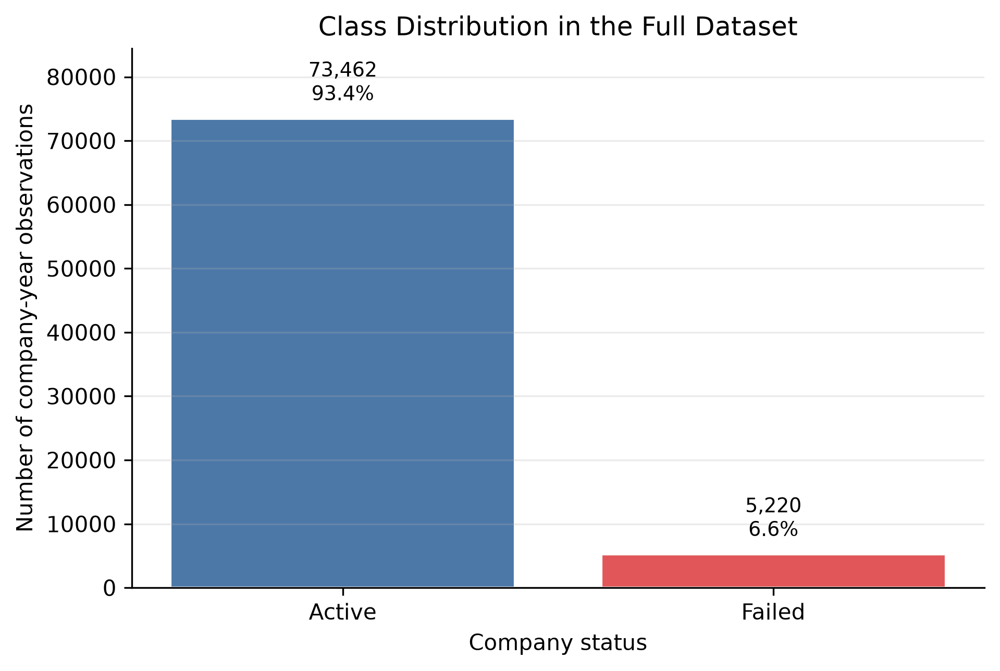
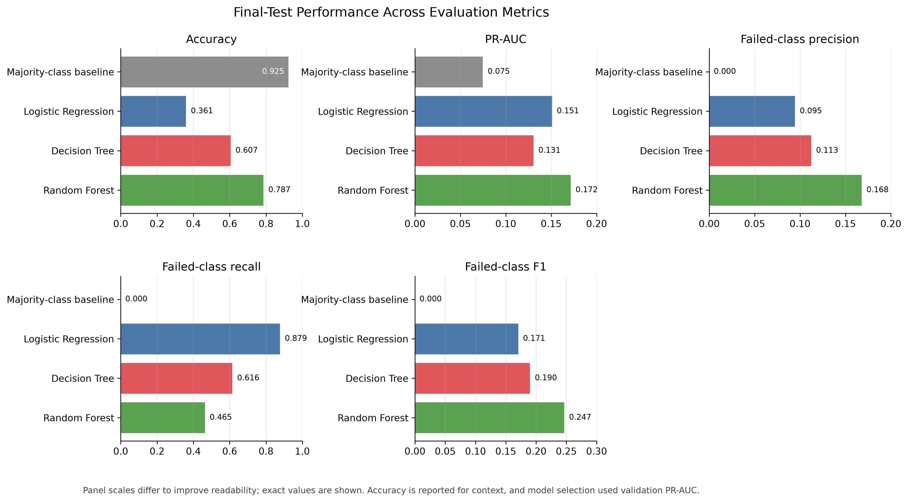
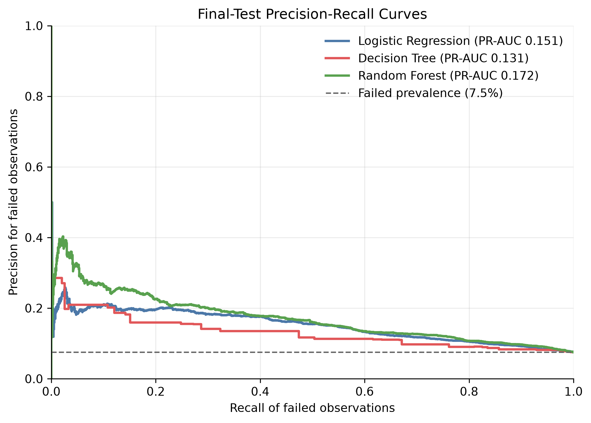

# Corporate Failure Classification Using Accounting Variables

**A Comparison of Logistic Regression, Decision Tree, and Random Forest**

This repository contains the notebook-based implementation of a Machine
Learning for Finance project on corporate failure classification using accounting variables.
The analysis is organized as five sequential Jupyter notebooks so that the
methodology, model selection, and results can be inspected and reproduced step
by step.

## Project Information

| Item | Information |
|---|---|
| Author | Berke Pehlivan |
| Course | Machine Learning for Finance |
| Institution | University of Bonn |
| Python | 3.11 |
| Interface | Jupyter notebooks |

## Final Paper

[Open the final paper](Berke_Pehlivan.pdf)

## Research Question

> How well can Logistic Regression, Decision Tree, and Random Forest classify
> failed and active company-year observations for companies not seen during
> model training, using 18 accounting variables?

This is a corporate failure classification study. It does not forecast whether
companies will fail after 2018 or within a specific future period.

## Dataset

The analysis uses the American corporate bankruptcy dataset published by
Lombardo et al. (2022), "Machine Learning for Bankruptcy Prediction in the
American Stock Market: Dataset and Benchmarks" (*Future Internet*, 14(8), 244,
DOI: 10.3390/fi14080244).

One row represents one company in one year. Companies can appear in several
years, so the train/test splits are made by company rather than by individual
row. The raw dataset is included in `data/raw/american_bankruptcy.csv`.

| Dataset property | Value |
|---|---:|
| Observations | 78,682 |
| Unique company identifiers | 8,971 |
| Years | 1999-2018 |
| Financial predictors | 18 (`X1`-`X18`) |
| Alive observations | 73,462 (93.4%) |
| Failed observations | 5,220 (6.6%) |
| Failure share | 6.6% |
| Missing values | 0 |
| Duplicate rows | 0 |

The source target labels are `alive` and `failed`. In the modelling files,
`failed` is encoded as `1` and `alive` as `0`; the failed class is the positive
class throughout the analysis. The original dataset remains subject to its
source and terms.

## Methodology

The workflow keeps model selection and final evaluation separate:

- an outer company-level train/test split uses test share `0.20`;
- an internal company-level training/validation split uses validation share
  `0.20`;
- all split operations use random state `42`;
- company identifiers are checked so companies do not overlap across splits;
- validation PR-AUC is the primary model-selection metric because the failed
  class is rare;
- the final test set is not used for model selection;
- after validation fixes the model settings, final models are refitted on the
  complete outer training sample;
- Notebook 05 only generates paper-ready assets from verified outputs.

## Models

The four retained model specifications are:

1. Majority-Class Baseline
2. Logistic Regression
3. Decision Tree
4. Random Forest

## Main Results

The table reports final-test metrics for the failed class using the saved
canonical output in `outputs/tables/final_test_metrics.csv`.

| Model | PR-AUC | F1 | Recall | Precision | Accuracy |
|---|---:|---:|---:|---:|---:|
| Majority-class baseline | 0.075 | 0.000 | 0.000 | 0.000 | 0.925 |
| Logistic Regression | 0.151 | 0.171 | 0.879 | 0.095 | 0.361 |
| Decision Tree | 0.131 | 0.190 | 0.616 | 0.113 | 0.607 |
| Random Forest | 0.172 | 0.247 | 0.465 | 0.168 | 0.787 |

The tree settings were selected using validation PR-AUC before the final test
set was evaluated. Random Forest has the highest final-test PR-AUC, precision,
and F1 among the retained learned models. Logistic Regression finds more failed
observations, but it also creates many more false alarms.

## Key Findings

- The majority-class baseline has high accuracy but detects no failed
  observations, so accuracy alone is misleading.
- PR-AUC is important because it evaluates ranking quality for the rare failed
  class more directly than accuracy.
- Logistic Regression has the highest failed-class recall, but its low
  precision means many active firms are also flagged.
- Random Forest gives the strongest final-test ranking result and the best
  failed-class F1 among the retained models.
- The Decision Tree is easier to inspect than the Random Forest, but its
  ranking performance is weaker on the final test sample.

## Selected Figures

The class-balance figure shows why the failed class requires special attention.



The model-performance summary compares final-test ranking and failed-class
operating metrics.



The precision-recall curves show the screening trade-off for the main
predictive models.



## Notebook Workflow

Run the notebooks in numerical order.

| Notebook | Purpose | Main inputs | Main outputs |
|---|---|---|---|
| [`01_data_audit_and_preparation.ipynb`](notebooks/01_data_audit_and_preparation.ipynb) | Audit the raw data, encode the target, remove constant predictors, and create the modelling table. | `data/raw/american_bankruptcy.csv` | `data/processed/model_dataset.csv`, data summary, target distribution, feature dictionary |
| [`02_company_split_and_eda.ipynb`](notebooks/02_company_split_and_eda.ipynb) | Create the outer company-level train/test split and descriptive EDA outputs. | `data/processed/model_dataset.csv` | `data/processed/train.csv`, `data/processed/test.csv`, split summary, annual failure-rate table |
| [`03_model_training_and_validation.ipynb`](notebooks/03_model_training_and_validation.ipynb) | Create the internal validation split, evaluate model candidates, and save selected specifications. | `data/processed/train.csv` | validation metrics and model specification |
| [`04_final_results_and_interpretation.ipynb`](notebooks/04_final_results_and_interpretation.ipynb) | Refit the four fixed specifications, evaluate the untouched final test set, and produce interpretation outputs. | train/test data, model specification | final-test metrics, final predictions, Logistic Regression coefficients, Random Forest feature importances |
| [`05_generate_paper_assets.ipynb`](notebooks/05_generate_paper_assets.ipynb) | Convert verified outputs into paper-ready tables and figures. | outputs from Notebooks 01-04 | `outputs/tables/`, `outputs/figures/` |

## Repository Structure

```text
ml-finance-bankruptcy-analysis/
├── Berke_Pehlivan.pdf
├── README.md
├── data/
│   ├── raw/
│   └── processed/
├── notebooks/
├── outputs/
│   ├── figures/
│   └── tables/
└── requirements.txt
```

## Installation and Execution

Python 3.11 is recommended because it is the course environment and the
environment used for the executed notebooks.

### macOS/Linux

```bash
git clone https://github.com/Berke-Pehli/ml-finance-bankruptcy-analysis.git
cd ml-finance-bankruptcy-analysis

python3.11 -m venv .venv
source .venv/bin/activate
python -m pip install --upgrade pip
python -m pip install -r requirements.txt
python -m ipykernel install \
    --user \
    --name ml-finance-bankruptcy-analysis-py311 \
    --display-name "Python 3.11 — Bankruptcy Analysis"
jupyter lab
```

### Windows PowerShell

```powershell
git clone https://github.com/Berke-Pehli/ml-finance-bankruptcy-analysis.git
cd ml-finance-bankruptcy-analysis

py -3.11 -m venv .venv
.venv\Scripts\Activate.ps1
python -m pip install --upgrade pip
python -m pip install -r requirements.txt
python -m ipykernel install `
    --user `
    --name ml-finance-bankruptcy-analysis-py311 `
    --display-name "Python 3.11 — Bankruptcy Analysis"
jupyter lab
```

After opening Jupyter, select `Python 3.11 — Bankruptcy Analysis` as the
notebook kernel. Notebook 03 takes the longest because it evaluates the
validation model candidates. Runtime may vary by computer.

The `.venv/` folder is local and ignored by Git.

## Command-Line Execution

After activating the environment and registering the kernel, the full notebook
workflow can also be executed from the command line:

```bash
for notebook in notebooks/0*.ipynb; do
    python -m jupyter nbconvert \
        --to notebook \
        --execute \
        --inplace \
        --ExecutePreprocessor.kernel_name=ml-finance-bankruptcy-analysis-py311 \
        --ExecutePreprocessor.timeout=900 \
        "$notebook"
done
```

## Paper

- [Compiled paper PDF](Berke_Pehlivan.pdf)

## Reproducibility Notes

- Python 3.11 is used for the executed notebooks.
- Dependency versions are pinned in `requirements.txt`.
- The notebooks use fixed random state `42`.
- Company-level grouping avoids direct company overlap between samples.
- Executed notebook outputs are saved in the repository.
- Generated CSV tables and figures are retained in `outputs/`.
- Small floating-point differences may occur across systems or numerical
  libraries, especially for tree-based model probabilities.
